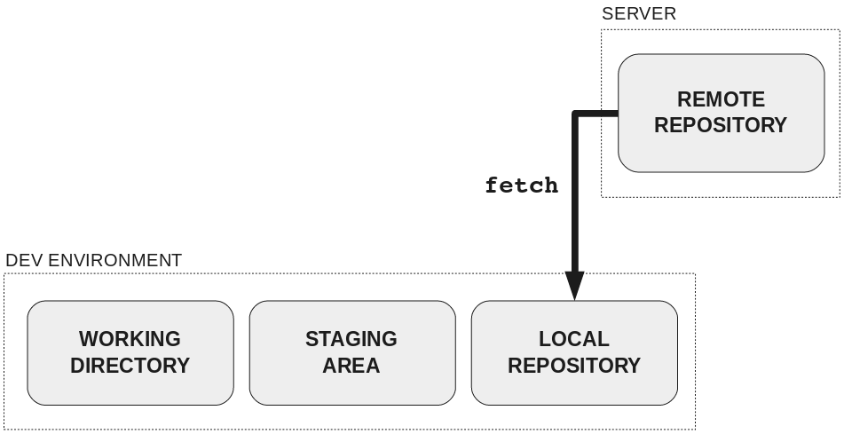

# Команда git fetch

[< к содержанию](../readme.md)

Для получения данных из удалённых проектов, следует выполнить: 

`$ git fetch [имя удал. сервера]`

Данная команда связывается с указанным удалённым проектом и забирает все те данные проекта, которых у вас ещё нет. После того как вы выполнили команду, у вас должны появиться ссылки на все ветки из этого удалённого проекта. Теперь эти ветки в любой момент могут быть просмотрены или слиты.

Когда вы клонируете репозиторий, команда **clone** автоматически добавляет этот удалённый репозиторий под именем *origin*. Таким образом, **git fetch origin** извлекает все наработки, отправленные (push) на этот сервер после того, как вы склонировали его (или получили изменения с помощью fetch). Как было сказано выше, команда **fetch** забирает данные в ваш локальный репозиторий, но не сливает их с какими-либо вашими наработками и не модифицирует то, над чем вы работаете в данный момент. Вам необходимо вручную слить этот код с вашим кодом в рабочей директории, когда вы будете готовы, с помощью [*git merge*](../articles/git_merge.md).

Возможно, более яснее станет, что делает **git fetch**, если посмотреть на эту картинку:

